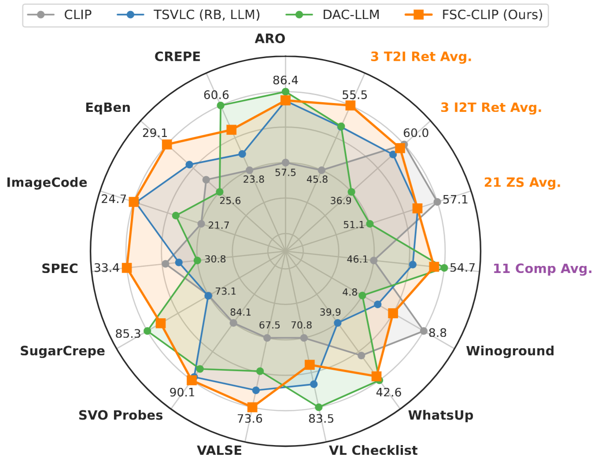

# <div align="center">Preserving Multi-Modal Capabilities of Pre-trained VLMs for Improving Vision-Linguistic Compositionality</div>

<div align="center">

[📄 [Paper](http://arxiv.org/abs/2410.05210) ]&nbsp; [🌍 [Project Page](https://ytaek-oh.github.io/fsc-clip) ] &nbsp;[🤗 [Models](https://huggingface.co/ytaek-oh/fsc-clip/tree/main) ]

</div>

This repository includes the official implementations of the paper:
> <a href="https://arxiv.org/abs/2410.05210"><b>Preserving Multi-Modal Capabilities of Pre-trained VLMs for Improving Vision-Linguistic Compositionality</b></a><br />
> [Youngtaek Oh](https://ytaek-oh.github.io), [Jae Won Cho](https://chojw.github.io/), [Dong-Jin Kim](https://sites.google.com/site/djkimcv/), [In So Kweon](http://rcv.kaist.ac.kr/), [Junmo Kim](http://siit.kaist.ac.kr/) <br />
> EMNLP 2024 (Long, Main) <br />

<br />

## 📰 News 

- We will be presenting our work at EMNLP 2024!

<br />

## 📦 What's Inside? 

- **Fine-tuning CLIP models**, including NegCLIP and our FSC-CLIP, on three image-text datasets: COCO, LAION-COCO, and CC-3M. This is built on top of the [OpenCLIP](https://github.com/mlfoundations/open_clip) framework.

- **Testing and Evaluation** of pre-trained and fine-tuned CLIP models for compositionality and multi-modal tasks, utilizing our [vl-compo](https://github.com/ytaek-oh/vl_compo) package.

- **Fine-tuned FSC-CLIP Checkpoints**, available for evaluation. Access them here: 🤗 [FSC-CLIP Models](https://huggingface.co/ytaek-oh/fsc-clip/tree/main).

<br />

## 📝 Abstract
**TL;DR;** We present a new fine-tuning framework to increase compositional reasoning of CLIP without sacrificing the multi-modal capabilities.
<details><summary>Click to expand</summary>
  <p>
  In this paper, we propose a new method to enhance compositional understanding in pre-trained vision and language models (VLMs) without sacrificing performance in zero-shot multi-modal tasks.
  </p>
  <p>
    Traditional fine-tuning approaches often improve compositional reasoning at the cost of degrading multi-modal capabilities, primarily due to the use of global hard negative (HN) loss, which contrasts global representations of images and texts. This global HN loss pushes HN texts that are highly similar to the original ones, damaging the model's multi-modal representations. 
  </p>
  <p>
    To overcome this limitation, we propose Fine-grained Selective Calibrated CLIP (FSC-CLIP), which integrates local hard negative loss and selective calibrated regularization. These innovations provide fine-grained negative supervision while preserving the model's representational integrity. 
  </p>
  <p>
    Our extensive evaluations across diverse benchmarks for both compositionality and multi-modal tasks show that FSC-CLIP not only achieves compositionality on par with state-of-the-art models but also retains strong multi-modal capabilities.
  </p>
</details>

<p align='center'>
   <br />
 <b>Holistic comparison of fine-tuning methods.</b> Enhancing compositional reasoning often degrades multi-modal task performances in previous models. Our $\texttt{FSC-CLIP}$ bridges this gap, minimizing these trade-offs.
</p>
<br />


## 🦁 Model Zoo

We provide a range of FSC-CLIP models, fine-tuned on various datasets and available in different architecture sizes.

**Update:** We've included a larger model, ViT-L-14, which was not covered in our paper, to offer additional benchmarks for broader use cases. 

### Available Models:

|    Checkpoint     |          CLIP |   Pretrained_Finetined |     Arch |  Comp  |  ZS  |  I2T Ret  |  T2I Ret  |
|-------------------|---------------|------------------------|----------|--------|------|-----------|-----------|
| 🤗 [Huggingface](https://huggingface.co/ytaek-oh/fsc-clip/resolve/main/coco_fsc-clip-ViT-B-32.pt?download=true) |      fsc-clip |            openai_coco  | ViT-B-32 |  54.2  | 55.7 |   66.3    |   58.3    |
| 🤗 [Huggingface](https://huggingface.co/ytaek-oh/fsc-clip/resolve/main/coco_fsc-clip-lora-ViT-B-32.pt?download=true) | fsc-clip-lora |            openai_coco  | ViT-B-32 |  53.6  | 55.5 |   65.2    |   57.2    |
| 🤗 [Huggingface](https://huggingface.co/ytaek-oh/fsc-clip/resolve/main/cc3m_fsc-clip-ViT-B-32.pt?download=true) |      fsc-clip |            openai_cc3m  | ViT-B-32 |  53.1  | 53.3 |   55.6    |   54.9    |
| 🤗 [Huggingface](https://huggingface.co/ytaek-oh/fsc-clip/resolve/main/cc3m_fsc-clip-lora-ViT-B-32.pt?download=true) | fsc-clip-lora |            openai_cc3m  | ViT-B-32 |  53.8  | 53.6 |   56.3    |   54.0    |
| 🤗 [Huggingface](https://huggingface.co/ytaek-oh/fsc-clip/resolve/main/laioncoco_fsc-clip-ViT-B-32.pt?download=true) |      fsc-clip |       openai_laioncoco  | ViT-B-32 |  53.5  | 55.3 |   58.2    |   55.5    |
| 🤗 [Huggingface](https://huggingface.co/ytaek-oh/fsc-clip/resolve/main/laioncoco_fsc-clip-lora-ViT-B-32.pt?download=true) | fsc-clip-lora |       openai_laioncoco  | ViT-B-32 |  54.2  | 55.9 |   57.3    |   54.3    |
| 🤗 [Huggingface](https://huggingface.co/ytaek-oh/fsc-clip/resolve/main/laioncoco_fsc-clip-ViT-B-16.pt?download=true) |      fsc-clip |       openai_laioncoco  | ViT-B-16 |  54.3  | 57.0 |   60.1    |   59.4    |
| 🤗 [Huggingface](https://huggingface.co/ytaek-oh/fsc-clip/resolve/main/laioncoco_fsc-clip-lora-ViT-B-16.pt?download=true) | fsc-clip-lora |       openai_laioncoco  | ViT-B-16 |  54.6  | 57.2 |   59.9    |   58.7    |
| 🤗 [Huggingface](https://huggingface.co/ytaek-oh/fsc-clip/resolve/main/laioncoco_fsc-clip-ViT-L-14.pt?download=true) |      fsc-clip |       openai_laioncoco  | ViT-L-14 |  55.2  | 64.0 |   64.9    |   64.9    |
| 🤗 [Huggingface](https://huggingface.co/ytaek-oh/fsc-clip/resolve/main/laioncoco_fsc-clip-lora-ViT-L-14.pt?download=true) | fsc-clip-lora |       openai_laioncoco  | ViT-L-14 |  56.2  | 62.2 |   64.2    |   63.7    |
| 🤗 [Huggingface](https://huggingface.co/ytaek-oh/fsc-clip/resolve/main/dcxl_fsc-clip-ViT-B-32.pt?download=true) |      fsc-clip |         dcxl_laioncoco  | ViT-B-32 |  52.9  | 61.1 |   56.8    |   53.8    |
| 🤗 [Huggingface](https://huggingface.co/ytaek-oh/fsc-clip/resolve/main/dcxl_fsc-clip-lora-ViT-B-32.pt?download=true) | fsc-clip-lora |         dcxl_laioncoco  | ViT-B-32 |  54.0  | 60.7 |   56.8    |   53.1    |

### Extended Results

For the results including individual compositionality benchmark scores: [extended_results.csv](./assets/extended_results.csv)

### Training Scripts

<details><summary><b>Click to expand</b></summary> 

<br />

```bash
# coco / coco with lora
python -m training.main \
    --save-frequency 1 --zeroshot-frequency 1 --val-frequency 1 --report-to tensorboard --log-every-n-steps 50 \
    --train-data="train_neg_clip" --model ViT-B-32 --pretrained openai \
    --lr=5e-6 --wd=0.1 --epochs=5 --warmup 50 --batch-size=256 --workers=4 \
    --add-random-text-hard-negatives="fsc-clip" \
    --loss-name="fsc-clip" --neg-loss-name="focal_loss" --focal-gamma 2.0 --neg-label-smoothing 0.02 \
    --apply-global-neg-loss --neg-loss-weight 0.5 \
    --return-dense-tokens --apply-local-neg-loss --local-neg-weight 0.2 \
    --logs="./logs/fsc-clip" \
    --name fsc-clip-coco

python -m training.main \
    --save-frequency 1 --zeroshot-frequency 1 --val-frequency 1 --report-to tensorboard --log-every-n-steps 50 \
    --train-data="train_neg_clip" --model ViT-B-32 --pretrained openai \
    --lr=5e-5 --wd=0.1 --epochs=5 --warmup 50 --batch-size=256 --workers=4 \
    --lora-rank 4 \
    --add-random-text-hard-negatives="fsc-clip" \
    --loss-name="fsc-clip" --neg-loss-name="focal_loss" --focal-gamma 2.0 --neg-label-smoothing 0.02 \
    --apply-global-neg-loss --neg-loss-weight 0.5 \
    --return-dense-tokens --apply-local-neg-loss --local-neg-weight 0.2 \
    --logs="./logs/fsc-clip" \
    --name fsc-clip-lora-coco

# cc3m / cc3m with lora
python -m training.main \
    --save-frequency 1 --zeroshot-frequency 1 --val-frequency 1 --report-to tensorboard --log-every-n-steps 50  \
    --train-data="cc3m_100k" --dataset-type="webdataset" --model ViT-B-32 --pretrained openai \
    --lr=5e-6 --wd=0.1 --epochs=5 --warmup 50 --batch-size=256 --workers=4 \
    --caption-key="coca_captions" --add-random-text-hard-negatives="fsc-clip" \
    --loss-name="fsc-clip" --neg-loss-name="focal_loss" --focal-gamma 2.0 --neg-label-smoothing 0.02 \
    --apply-global-neg-loss --neg-loss-weight 1.0 \
    --return-dense-tokens --apply-local-neg-loss --local-neg-weight 0.2 \
    --logs="./logs/fsc-clip" \
    --name fsc-clip-cc3m

python -m training.main \
    --save-frequency 1 --zeroshot-frequency 1 --val-frequency 1 --report-to tensorboard --log-every-n-steps 50  \
    --train-data="cc3m_100k" --dataset-type="webdataset" --model ViT-B-32 --pretrained openai \
    --lr=5e-5 --wd=0.1 --epochs=5 --warmup 50 --batch-size=256 --workers=4 \
    --lora-rank 4 \
    --caption-key="coca_captions" --add-random-text-hard-negatives="fsc-clip" \
    --loss-name="fsc-clip" --neg-loss-name="focal_loss" --focal-gamma 2.0 --neg-label-smoothing 0.02 \
    --apply-global-neg-loss --neg-loss-weight 1.0 \
    --return-dense-tokens --apply-local-neg-loss --local-neg-weight 0.2 \
    --logs="./logs/fsc-clip" \
    --name fsc-clip-lora-cc3m

# pretrained: openai, finetuned: laioncoco, arch: ViT-B-32 (+ with lora)
python -m training.main \
    --save-frequency 1 --zeroshot-frequency 1 --val-frequency 1 --report-to tensorboard --log-every-n-steps 50 \
    --train-data="laioncoco_100k" --dataset-type="webdataset" --model ViT-B-32 --pretrained openai \
    --lr=5e-6 --wd=0.1 --epochs=5 --warmup 50 --batch-size=256 --workers=4 \
    --caption-key="caption" --add-random-text-hard-negatives="fsc-clip" \
    --loss-name="fsc-clip" --neg-loss-name="focal_loss" --focal-gamma 2.0 --neg-label-smoothing 0.02 \
    --apply-global-neg-loss --neg-loss-weight 0.5 \
    --return-dense-tokens --apply-local-neg-loss --local-neg-weight 0.2 \
    --logs="./logs/fsc-clip" \
    --name fsc-clip-laioncoco

python -m training.main \
    --save-frequency 1 --zeroshot-frequency 1 --val-frequency 1 --report-to tensorboard --log-every-n-steps 50 \
    --train-data="laioncoco_100k" --dataset-type="webdataset" --model ViT-B-32 --pretrained openai \
    --lr=5e-5 --wd=0.1 --epochs=5 --warmup 50 --batch-size=256 --workers=4 \
    --lora-rank 4 \
    --caption-key="caption" --add-random-text-hard-negatives="fsc-clip" \
    --loss-name="fsc-clip" --neg-loss-name="focal_loss" --focal-gamma 2.0 --neg-label-smoothing 0.02 \
    --apply-global-neg-loss --neg-loss-weight 0.5 \
    --return-dense-tokens --apply-local-neg-loss --local-neg-weight 0.2 \
    --logs="./logs/fsc-clip" \
    --name fsc-clip-lora-laioncoco

# pretrained: openai, finetuned: laioncoco, arch: ViT-B-16 (+ with lora)
python -m training.main \
    --save-frequency 1 --zeroshot-frequency 1 --val-frequency 1 --report-to tensorboard --log-every-n-steps 50 \
    --train-data="laioncoco_100k" --dataset-type="webdataset" --model ViT-B-16 --pretrained openai \
    --lr=5e-6 --wd=0.1 --epochs=5 --warmup 50 --batch-size=128 --workers=4 \
    --caption-key="caption" --add-random-text-hard-negatives="fsc-clip" \
    --loss-name="fsc-clip" --neg-loss-name="focal_loss" --focal-gamma 2.0 --neg-label-smoothing 0.02 \
    --apply-global-neg-loss --neg-loss-weight 0.5 \
    --return-dense-tokens --apply-local-neg-loss --local-neg-weight 0.5 \
    --logs="./logs/fsc-clip" \
    --name fsc-clip-vitb16-laioncoco

python -m training.main \
    --save-frequency 1 --zeroshot-frequency 1 --val-frequency 1 --report-to tensorboard --log-every-n-steps 50 \
    --train-data="laioncoco_100k" --dataset-type="webdataset" --model ViT-B-16 --pretrained openai \
    --lr=5e-5 --wd=0.1 --epochs=5 --warmup 50 --batch-size=128 --workers=4 \
    --lora-rank 4 \
    --caption-key="caption" --add-random-text-hard-negatives="fsc-clip" \
    --loss-name="fsc-clip" --neg-loss-name="focal_loss" --focal-gamma 2.0 --neg-label-smoothing 0.02 \
    --apply-global-neg-loss --neg-loss-weight 0.5 \
    --return-dense-tokens --apply-local-neg-loss --local-neg-weight 0.5 \
    --logs="./logs/fsc-clip" \
    --name fsc-clip-lora-vitb16-laioncoco

# pretrained: openai, finetuned: laioncoco, arch: ViT-L-14 (+ with lora)
torchrun --nproc_per_node 4 -m training.main \
     --save-frequency 1 --zeroshot-frequency 1 --val-frequency 1 --report-to tensorboard --log-every-n-steps 50 \
     --train-data="laioncoco_100k" --dataset-type="webdataset" --model ViT-L-14 --pretrained openai \
     --lr=5e-6 --wd=0.1 --epochs=5 --warmup 50 --batch-size=64 --workers=2 \
     --caption-key="caption" --add-random-text-hard-negatives="fsc-clip" \
     --loss-name="fsc-clip" --neg-loss-name="focal_loss" --focal-gamma 2.0 --neg-label-smoothing 0.02 \
     --apply-global-neg-loss --neg-loss-weight 0.5 \
     --return-dense-tokens --apply-local-neg-loss --local-neg-weight 0.5 \
     --logs="./logs/fsc-clip" \
     --name dist-fsc-clip-vitl14-laioncoco

torchrun --nproc_per_node 4 -m training.main \
     --save-frequency 1 --zeroshot-frequency 1 --val-frequency 1 --report-to tensorboard --log-every-n-steps 50 \
     --train-data="laioncoco_100k" --dataset-type="webdataset" --model ViT-L-14 --pretrained openai \
     --lr=5e-5 --wd=0.1 --epochs=5 --warmup 50 --batch-size=64 --workers=2 \
     --lora-rank 4 \
     --caption-key="caption" --add-random-text-hard-negatives="fsc-clip" \
     --loss-name="fsc-clip" --neg-loss-name="focal_loss" --focal-gamma 2.0 --neg-label-smoothing 0.02 \
     --apply-global-neg-loss --neg-loss-weight 0.5 \
     --return-dense-tokens --apply-local-neg-loss --local-neg-weight 0.5 \
     --logs="./logs/fsc-clip" \
     --name dist-fsc-clip-lora-vitl14-laioncoco

# pretrained: dcxl, finetined: laioncoco, arch: ViT-B-32 (+ with lora)
python -m training.main \
    --save-frequency 1 --zeroshot-frequency 1 --val-frequency 1 --report-to tensorboard --log-every-n-steps 50 \
    --train-data="laioncoco_100k" --dataset-type="webdataset" --model ViT-B-32 --pretrained datacomp_xl_s13b_b90k \
    --lr=5e-6 --wd=0.1 --epochs=5 --warmup 50 --batch-size=256 --workers=4 \
    --caption-key="caption" --add-random-text-hard-negatives="fsc-clip" \
    --loss-name="fsc-clip" --neg-loss-name="focal_loss" --focal-gamma 2.0 --neg-label-smoothing 0.02 \
    --apply-global-neg-loss --neg-loss-weight 0.5 \
    --return-dense-tokens --apply-local-neg-loss --local-neg-weight 0.2 \
    --logs="./logs/fsc-clip" \
    --name fsc-clip-dcxl-laioncoco

python -m training.main \
    --save-frequency 1 --zeroshot-frequency 1 --val-frequency 1 --report-to tensorboard --log-every-n-steps 50 \
    --train-data="laioncoco_100k" --dataset-type="webdataset" --model ViT-B-32 --pretrained datacomp_xl_s13b_b90k \
    --lr=5e-5 --wd=0.1 --epochs=5 --warmup 50 --batch-size=256 --workers=4 \
    --lora-rank 4 \
    --caption-key="caption" --add-random-text-hard-negatives="fsc-clip" \
    --loss-name="fsc-clip" --neg-loss-name="focal_loss" --focal-gamma 2.0 --neg-label-smoothing 0.02 \
    --apply-global-neg-loss --neg-loss-weight 0.5 \
    --return-dense-tokens --apply-local-neg-loss --local-neg-weight 0.2 \
    --logs="./logs/fsc-clip" \
    --name fsc-clip-lora-dcxl-laioncoco
```


</details>

<br />

## 🚀 Installation

The code requires `python>=3.11` for training. For inference, other Python versions may work.


### Environment setup

The code has been tested in the following environment:

-   Python 3.11, CUDA 11.7, PyTorch 2.0.1, open_clip 2.24.0
-   Training was conducted on a Quadro RTX 8000 GPU (45GB memory).

<br />

### Install via Docker

To simplify the setup, we provide a Docker script for a one-click installation:

```bash
git clone https://github.com/ytaek-oh/fsc-clip.git && cd fsc-clip/docker
docker build --build-arg USER_ID=$UID -t fsc-clip:v0 .
./run_docker.sh   # Modify as needed before running
```

<br />

### Install via Conda (Optional)

If you prefer using conda, which can also be used within the Docker container above, set it up as follows:

```bash
conda create -n fsc-clip python=3.11 -y
conda activate fsc-clip
pip install -e .
```

<br />


## 🔍 Useful Guide

-   `src/training/models/`: Manages model loading.
-   `src/training/losses/`: Implements CLIP-related losses, including our LHN Loss and SCR mechanism.
-   `src/training/text_negatives/`: Generates hard negative captions.
-   `src/training/data.py`: Defines the dataset classes and pipeline.
-   `src/training/eval_compo.py`: Manages the evaluation pipeline using the `vl_compo` package.<br /><br />
-   Additional custom options, beyond the standard open_clip training parameters, can be found in `add_custom_options()` within `src/training/params.py`. Please review these parameters before use.
-   Some files in `src/open_clip/`, such as `model.py` and `transformer.py`, have been modified to allow models to return local tokens during training when the `--return-dense-token` flag is activated.

<br />

## 📊 Evaluation

**Note:** Currently unavailable as the `vl_compo` package has not been released yet 😭😭. Please stay tuned, and consider watching the repository for updates!


### Inference on Pre-trained Models in OpenCLIP

```
Details coming soon.
```

### Inference on Fine-tuned Models Listed in vl_compo

```
Details coming soon.
```
### Inference on a Custom Fine-tuned Model with a Checkpoint

```
Details coming soon.
```

### Applying WiSE-FT (Weight Interpolation) Between Fine-tuned and Pre-trained Models

```
Details coming soon.
```

<br />


## 🏋️‍♂️ Training

**Note:** The training datasets will be downloaded and set up in the specified directory using the `--train-data-root` flag when the code is executed.

### Expected Directory Structure:
-   The dataset location can be located either inside or outside the source code directory.

```
{TRAIN_DATA_ROOT}/
├── coco/
│   ├── images/
│   │   ├── train2014/
│   │   └── val2014/
│   └── train_neg_clip.tsv
├── laioncoco/
│   └── train_subset_100K/
│       └── {00000-00013}.tar
└── cc3m/
    └── train_subset_100K/
        ├── coca_captions/
        └── {00000-00014}.tar
```

- Evaluation results and the corresponding checkpoint will be saved in `logs/{MODEL_NAME}/checkpoints`.

---

### Fine-tuning Standard CLIP and NegCLIP Models

<details>
<summary>
<b>Fine-tuning CLIP on COCO, CC-3M, and LAION-COCO using Standard CLIP Loss</b>
</summary> 

<br />

```bash
# Fine-tuning on COCO with --train-data="train_neg_clip"
python -m training.main \
    --save-frequency 1 --zeroshot-frequency 1 --val-frequency 1 --report-to tensorboard --log-every-n-steps 50 \
    --train-data="train_neg_clip" --model ViT-B-32 --pretrained openai \
    --lr=5e-6 --wd=0.1 --epochs=5 --warmup 50 --batch-size=256 --workers=4 \
    --loss-name="clip" \
    --logs="./logs/clip" \
    --name coco_clip-openai_ViT-B-32

# Fine-tuning on CC-3M with --train-data="cc3m_100k" and --caption-key="coca_captions"
python -m training.main \
    --save-frequency 1 --zeroshot-frequency 1 --val-frequency 1 --report-to tensorboard --log-every-n-steps 50  \
    --train-data="cc3m_100k" --dataset-type="webdataset" --model ViT-B-32 --pretrained openai \
    --lr=5e-6 --wd=0.1 --epochs=5 --warmup 50 --batch-size=256 --workers=4 \
    --caption-key="coca_captions" \
    --loss-name="clip" \
    --logs="./logs/clip" \
    --name cc3m_clip-openai_ViT-B-32

# Fine-tuning on LAION-COCO with --train-data="laioncoco_100k" and --caption-key="caption"
python -m training.main \
    --save-frequency 1 --zeroshot-frequency 1 --val-frequency 1 --report-to tensorboard --log-every-n-steps 50  \
    --train-data="laioncoco_100k" --dataset-type="webdataset" --model ViT-B-32 --pretrained openai \
    --lr=5e-6 --wd=0.1 --epochs=5 --warmup 50 --batch-size=256 --workers=4 \
    --caption-key="caption" \
    --loss-name="clip" \
    --logs="./logs/clip" \
    --name laioncoco_clip-openai_ViT-B-32
```

</details>


<details>
<summary>
<b>Training NegCLIP with Hard Negative Captions</b>
</summary> 

<br />

To train NegCLIP with hard negative captions, include the following flag in the command: `--add-random-text-hard-negatives="negclip"`.

```bash
# NegCLIP fine-tuning on LAION-COCO
python -m training.main \
    --save-frequency 1 --zeroshot-frequency 1 --val-frequency 1 --report-to tensorboard --log-every-n-steps 50  \
    --train-data="laioncoco_100k" --dataset-type="webdataset" --model ViT-B-32 --pretrained openai \
    --lr=5e-6 --wd=0.1 --epochs=5 --warmup 50 --batch-size=256 --workers=4 \
    --caption-key="caption" --add-random-text-hard-negatives="negclip" \
    --loss-name="clip" \
    --logs="./logs/negclip" \
    --name laioncoco_negclip-openai_ViT-B-32
```

</details>

---


### Fine-tuning via FSC-CLIP

-  Use `--add-random-text-hard-negatives="fsc-clip"` and `--loss-name="fsc-clip"` to enable FSC-CLIP fine-tuning.
- Requires >44GB VRAM per GPU. If an out-of-memory (OOM) error occurs, it is recommended to reduce the batch size to 128.

<br />

<details>
<summary>
<b>FSC-CLIP with the default parameters</b>
</summary> 

<br />

```bash
# Fine-tuning all the default parameters with FSC-CLIP
python -m training.main \
    --save-frequency 1 --zeroshot-frequency 1 --val-frequency 1 --report-to tensorboard --log-every-n-steps 50 \
    --train-data="laioncoco_100k" --dataset-type="webdataset" --model ViT-B-32 --pretrained openai \
    --lr=5e-6 --wd=0.1 --epochs=5 --warmup 50 --batch-size=256 --workers=4 \
    --caption-key="caption" --add-random-text-hard-negatives="fsc-clip" \
    --loss-name="fsc-clip" --neg-loss-name="focal_loss" --focal-gamma 2.0 --neg-label-smoothing 0.02 \
    --apply-global-neg-loss --neg-loss-weight 0.5 \
    --return-dense-tokens --apply-local-neg-loss --local-neg-weight 0.2 \
    --logs="./logs/fsc-clip" \
    --name laioncoco_fsc-clip-openai_ViT-B-32
```

</details>


<details>
<summary>
<b>Fine-tuning using LoRA</b>
</summary> 

<br />

To fine-tune with LoRA, apply a **10x** increase to the learning rate.

```bash
# Fine-tuning with LoRA
python -m training.main \
    --save-frequency 1 --zeroshot-frequency 1 --val-frequency 1 --report-to tensorboard --log-every-n-steps 50 \
    --train-data="laioncoco_100k" --dataset-type="webdataset" --model ViT-B-32 --pretrained openai \
    --lr=5e-5 --wd=0.1 --epochs=5 --warmup 50 --batch-size=256 --workers=4 \
    --lora-rank 4 \
    --caption-key="caption" --add-random-text-hard-negatives="fsc-clip" \
    --loss-name="fsc-clip" --neg-loss-name="focal_loss" --focal-gamma 2.0 --neg-label-smoothing 0.02 \
    --apply-global-neg-loss --neg-loss-weight 0.5 \
    --return-dense-tokens --apply-local-neg-loss --local-neg-weight 0.2 \
    --logs="./logs/fsc-clip" \
    --name laioncoco_fsc-clip-lora-openai_ViT-B-32
```

</details>


<details>
<summary>
<b>Distributed Training on ViT-L-14</b>
</summary> 

<br />

```bash
# DDP training across 4 GPUs on a single node, with a batch size of 64 per GPU.
torchrun --nproc_per_node 4 -m training.main \
     --save-frequency 1 --zeroshot-frequency 1 --val-frequency 1 --report-to tensorboard --log-every-n-steps 50 \
     --train-data="laioncoco_100k" --dataset-type="webdataset" --model ViT-L-14 --pretrained openai \
     --lr=5e-6 --wd=0.1 --epochs=5 --warmup 50 --batch-size=64 --workers=2 \
     --caption-key="caption" --add-random-text-hard-negatives="fsc-clip" \
     --loss-name="fsc-clip" --neg-loss-name="focal_loss" --focal-gamma 2.0 --neg-label-smoothing 0.02 \
     --apply-global-neg-loss --neg-loss-weight 0.5 \
     --return-dense-tokens --apply-local-neg-loss --local-neg-weight 0.5 \
     --logs="./logs/fsc-clip" \
     --name laioncoco_fsc-clip-openai_ViT-L-14
```

</details>

<br />


## 🙏🏻 Acknowledgements 

-   This project is built on the excellent [open_clip](https://github.com/mlfoundations/open_clip) repository, licensed under [MIT License](https://github.com/mlfoundations/open_clip/blob/main/LICENSE).
-   We utilize the hard negative caption generation methods, `negclip` and `replace` from [CLoVe](https://github.com/Netflix/clove), licensed under [MIT License](https://github.com/Netflix/clove/blob/main/LICENSE).


<br />

## 📜 Citation

If you find this work useful, please give it a star ⭐ and consider citing our papers:

```bibtex
@article{oh2024preserving,
  title={Preserving Multi-Modal Capabilities of Pre-trained VLMs for Improving Vision-Linguistic Compositionality},
  author={Oh, Youngtaek and Cho, Jae Won and Kim, Dong-Jin and Kweon, In So and Kim, Junmo},
  journal={arXiv preprint arXiv:2410.05210},
  year={2024}
}

@article{oh2024exploring,
  title={Exploring the Spectrum of Visio-Linguistic Compositionality and Recognition},
  author={Oh, Youngtaek and Ahn, Pyunghwan and Kim, Jinhyung and Song, Gwangmo and Lee, Soonyoung and Kweon, In So and Kim, Junmo},
  journal={arXiv preprint arXiv:2406.09388},
  year={2024}
}
```
